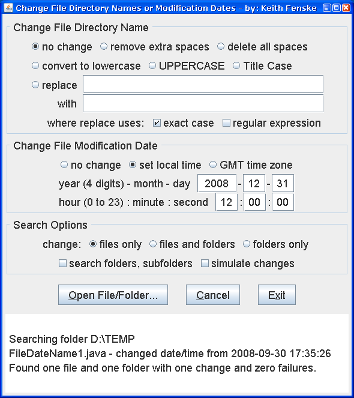

### File Redate Rename (Java)

by: Keith Fenske, https://kwfenske.github.io/

FileDateName is a Java 1.4 graphical (GUI) application to rename multiple files
or to change their directory dates. The contents of the files are not changed.
Folders and subfolders may be searched recursively. Changes may be applied to
files only, both files and folders, or only the folders.

Download the ZIP file here: https://kwfenske.github.io/file-redate-rename-java.zip

Released under the terms and conditions of the Apache License (version 2.0 or
later) and/or the GNU General Public License (GPL, version 2 or later).

